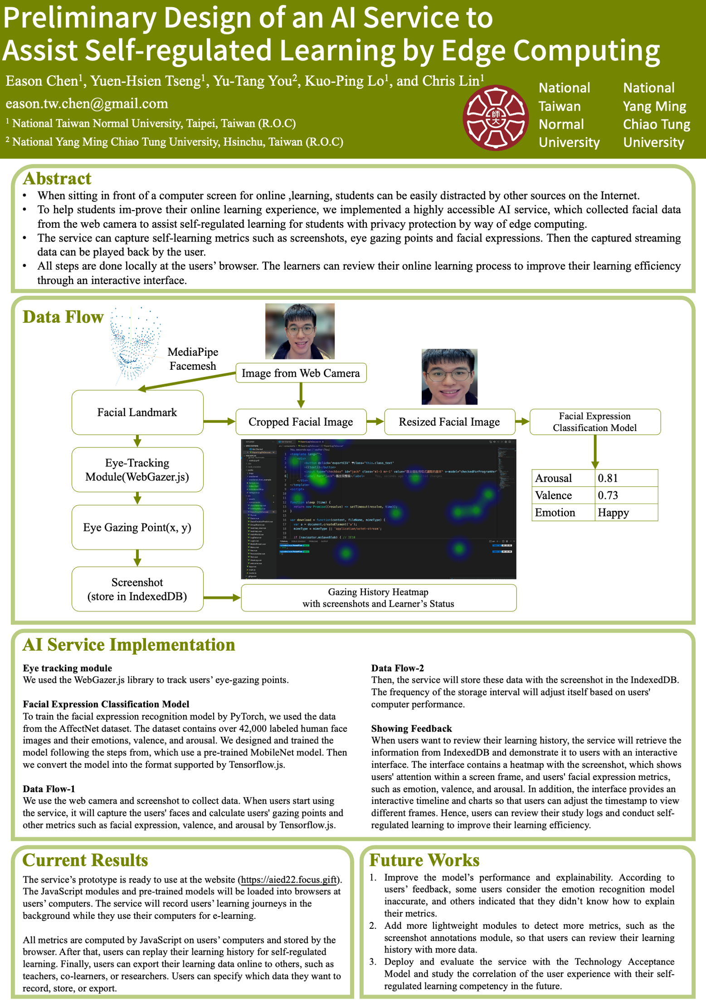

When sitting in front of a computer screen for online learning, students can be easily distracted by other sources on the Internet. 

To help students im-prove their online learning experience, we implemented a highly accessible AI service, which collected facial data from the web camera to assist self-regulated learning for students with privacy protection by way of edge computing. Moreover, Focus can capture self-learning metrics such as eye gazing points and facial expressions. 

Then the captured facial streaming data can be played back by the user. All steps are done locally at the users' browser. The learners can review their online learning process to improve their learning efficiency through an interactive interface. Our preliminary evaluation showed promising feedback from real users.

## Relative Papers:
[1] [Preliminary Design of an AI Service to Assist Self-regulated Learning by Edge Computing.](https://link.springer.com/chapter/10.1007/978-3-031-11647-6_119)

[2] [Focus Plus: Detect Learner's Distraction by Web Camera in Distance Teaching](https://arxiv.org/abs/2210.04400)

Poster:

